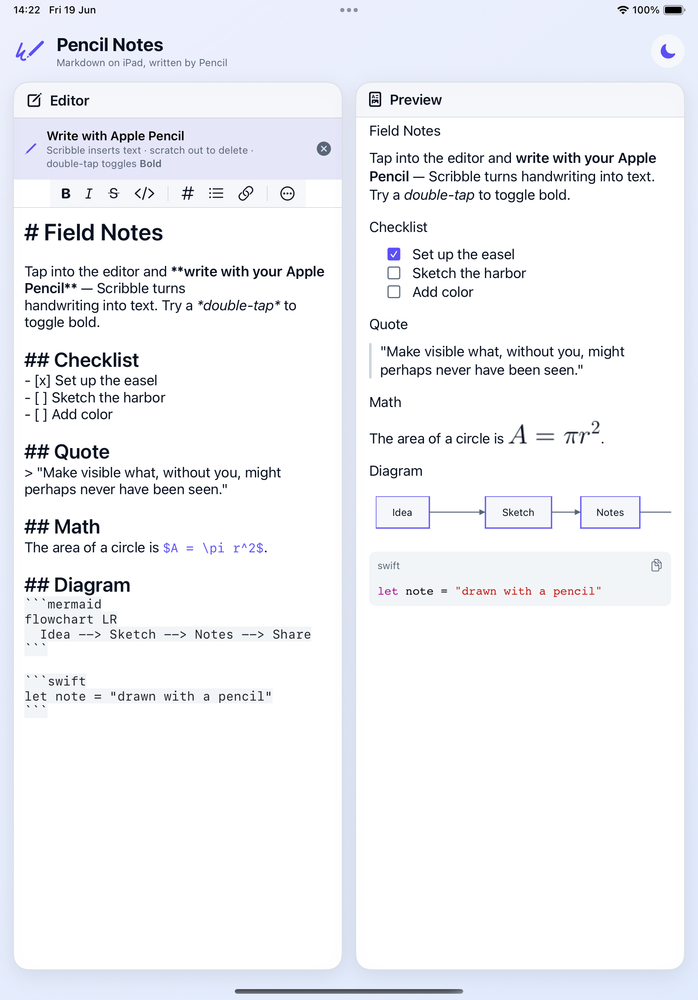

# PencilNotes — iPad + Apple Pencil example

An iPad-first example app for SwiftMarkdownEngine that showcases the editor with
**Apple Pencil** next to a live, fully-featured preview. The `.xcodeproj` is generated
from `project.yml` (via [XcodeGen](https://github.com/yonaskolb/XcodeGen)) and is
git-ignored.



## Run

```bash
brew install xcodegen          # once
cd Examples/PencilNotes
xcodegen generate
open PencilNotes.xcworkspace    # ← open the WORKSPACE, then Run on an iPad
```

> **Open `PencilNotes.xcworkspace`, not `PencilNotes.xcodeproj`.** The engine package
> lives at the repo root (the parent of this folder). Opening the bare project makes
> Xcode reach the package through a security-scoped bookmark, which can leave it stuck
> showing `?` under *Package Dependencies*. The workspace includes the package as a
> first-class member, so it always resolves. If you ever see a stuck `?`, quit Xcode
> and `rm -rf ../../.swiftpm` (a stale, git-ignored cache).

Or from the command line:

```bash
xcodebuild build -workspace PencilNotes.xcworkspace -scheme PencilNotes \
  -destination 'platform=iOS Simulator,name=iPad Pro 11-inch (M4)' CODE_SIGNING_ALLOWED=NO
```

## What it demonstrates

- **Apple Pencil** — Scribble writes/edits text in the `MarkdownEditor` on iPad, and a
  **configured double-tap** toggles bold via `MarkdownEditor(text:onPencilDoubleTap:)`,
  with an on-screen toast confirming the action.
- **Adaptive layout** — side-by-side editor + preview on iPad (regular width); tabbed on
  compact width.
- **Live preview** with the optional bridges injected through `MarkdownServices`:
  - highlighted code (`MarkdownEngineCodeBlocks` → Highlightr),
  - rendered LaTeX (`MarkdownEngineLatex` → SwiftMath),
  - native Mermaid diagrams, GFM tables, and interactive task checkboxes.
- **Theming** — light/dark toggle using a customized `MarkdownTheme` (indigo accent,
  reading-width column).

## Apple Pencil on a real device

Scribble, hover, and squeeze can't be exercised in the simulator or by automated tests —
they need a physical iPad. See [`docs/DEVICE_TESTING.md`](../../docs/DEVICE_TESTING.md)
for the manual on-device checklist.

## App icon

A stylish pencil on an indigo→cyan gradient, in `App/Assets.xcassets/AppIcon.appiconset`.
Regenerate with `python3 AppIconGenerator.py` (requires Pillow).
